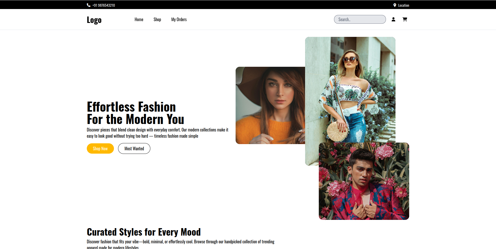
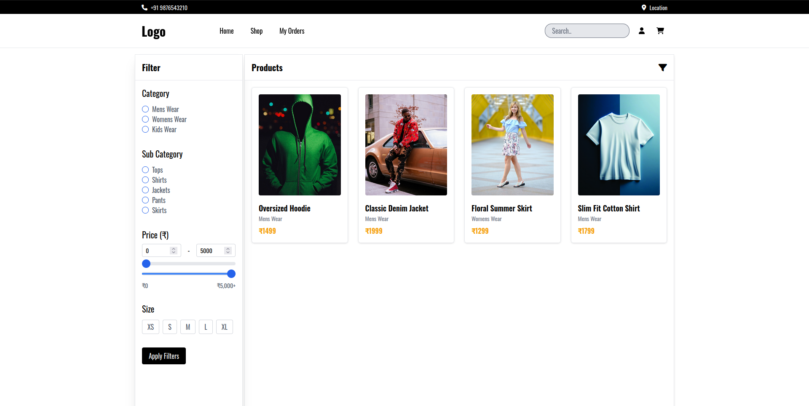
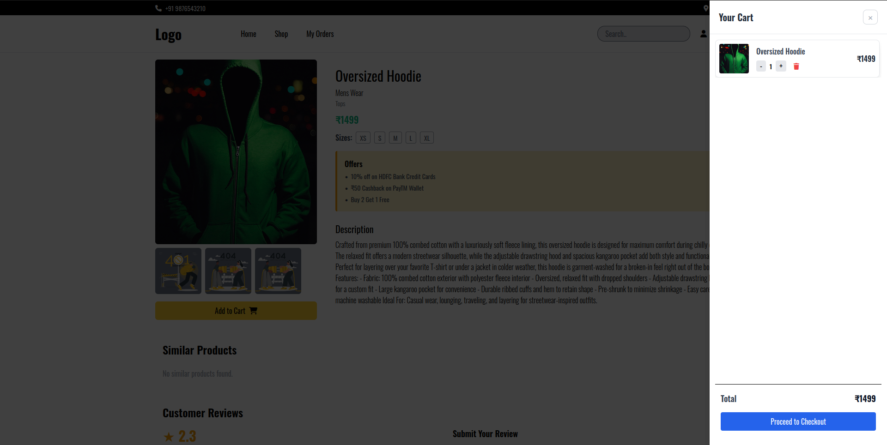

# 🛍️ Fashion E-commerce (MERN Stack)

A fully functional **Fashion E-commerce** platform built with the **MERN stack** — MongoDB, Express.js, React.js, and Node.js — featuring **secure authentication**, **product management**, **shopping cart**, **checkout with Razorpay**, and **Cloudinary image uploads**.



---

## ✨ Features

### 🧑‍💻 User Side
- **JWT Authentication & Authorization** (Register, Login, Logout)
- Browse and search products
- Add to Cart & update quantities
- Fully responsive design

### 🛠️ Admin Side
- Add, edit & delete products
- Upload images to Cloudinary (cover + gallery)
- Manage orders & view dashboard stats
- Role-based access control

---

## 🛠 Tech Stack

**Frontend:**
- React.js
- React Router
- React Query
- Tailwind CSS + Flowbite

**Backend:**
- Node.js
- Express.js
- MongoDB + Mongoose

**Other Tools:**
- JWT for authentication
- Multer for file uploads
- Cloudinary for image storage
- dotenv for environment config

---

## ⚙️ Installation & Setup

### 1️⃣ Clone Repository
```bash
git clone https://github.com/<your-username>/fashion-ecommerce.git
cd fashion-ecommerce
```

### 2️⃣ Install Dependencies
```bash
# Backend
npm install

# Frontend
cd ../client
npm install
```

### 3️⃣ Environment Variables
Create `.env` in the **server** folder:
```env
PORT=5000
MONGO_URI=your_mongodb_connection
JWT_SECRET=your_jwt_secret
JWT_EXPIRES_IN=7d
FRONT_END_URL=http://localhost:5173
CLOUDINARY_CLOUD_NAME=your_cloudinary_name
CLOUDINARY_API_KEY=your_cloudinary_key
CLOUDINARY_API_SECRET=your_cloudinary_secret
RAZORPAY_KEY_ID=your_razorpay_key
NODE_ENV=dev_or_production
```

Create `.env` in the **client** folder:
```env
VITE_API_BASE_URL=http://localhost:5000/api
VITE_CLOUDINARY_CLOUD_NAME=cloudinary_cloud_name
VITE_CLOUDINARY_UPLOAD_PRESET=present_mode
```

### 4️⃣ Run the App
```bash
# From the project root
npm run dev
```

---

## 📸 Screenshots

| Home Page | Product Page |
|-----------|--------------|
|  |  |

| Cart | Dashboard |
|------|-----------|
|  |  |

---

## 📚 Learning Highlights
- Built full-stack authentication with JWT
- Designed RESTful APIs with Express & MongoDB
- Implemented Cloudinary + Multer image uploads
- Used React Query for efficient data fetching
- Followed scalable folder structure

---

## 🚀 Future Enhancements
- Payment Integration
- Wishlist feature
- Advanced analytics
- Email notifications
---

## 👨‍💻 Author
**Adarsh Antony**
- LinkedIn: [@adarshantony](https://www.linkedin.com/in/adarshantony)
- Instagram: [@adarshantony](https://instagram.com/__._adarsh.____)
- Portfolio: *(coming soon)*

---

## 📜 License
This project is licensed under the MIT License.